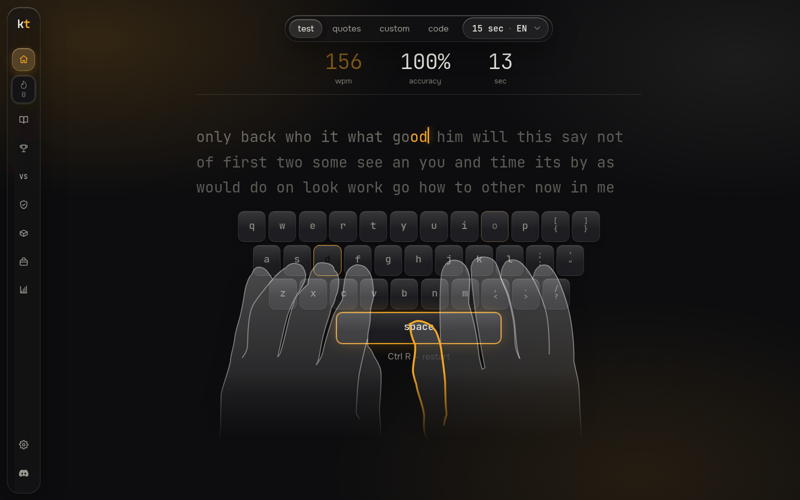

# keytype — тренажёр слепой печати и тест скорости

**Бесплатный тест скорости печати, клавиатурный тренажёр и онлайн-гонки.** Без рекламы, без регистрации. 12 языков.

👉 **Играть в браузере: [keytype.pro](https://keytype.pro/typing-test/ru)** · 🪟 **[Скачать для Windows](https://keytype.pro/download/keytype-setup.exe)**

- **Тест скорости** — на время (от 15 секунд до 5 минут) или по числу слов, WPM / CPM / CPS и точность в реальном времени
- **Обучение слепой печати** — уроки открывают новые клавиши по мере роста точности и скорости
- **Цитаты, свой текст и код** — код на 12 языках программирования
- **Ranked** — 30-секундные гонки 1 на 1, Elo, лиги от Бронзы до Легенды, ежемесячные сезоны
- **Дуэли** с друзьями, **косметика** (кейкапы, клавиатуры, скины рук) — только за игру
- **4 макета** (Glass, Matte, Modern, Classic), темы, свои шрифты, экранная клавиатура и подсказки пальцев

**macOS и Linux.** Версия для macOS в планах. А пока keytype полностью работает в любом браузере на macOS и Linux — просто откройте [keytype.pro](https://keytype.pro/typing-test/ru) (Safari, Chrome или Firefox; для тренировки без отвлечений включите полноэкранный режим браузера).

Гайды: [как печатать быстрее](https://keytype.pro/guides/how-to-type-faster/ru) · [слепая печать с нуля](https://keytype.pro/guides/touch-typing/ru) · [средняя скорость печати](https://keytype.pro/guides/average-typing-speed/ru)

Telegram: https://t.me/key_type · Discord: https://discord.gg/WPdbjnNDst

[English version](README.md)
